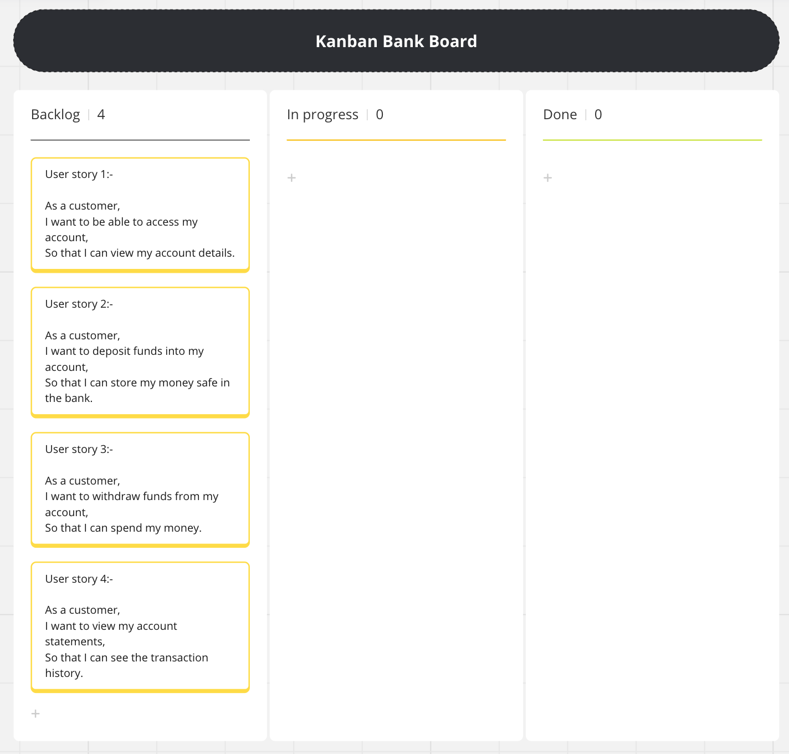
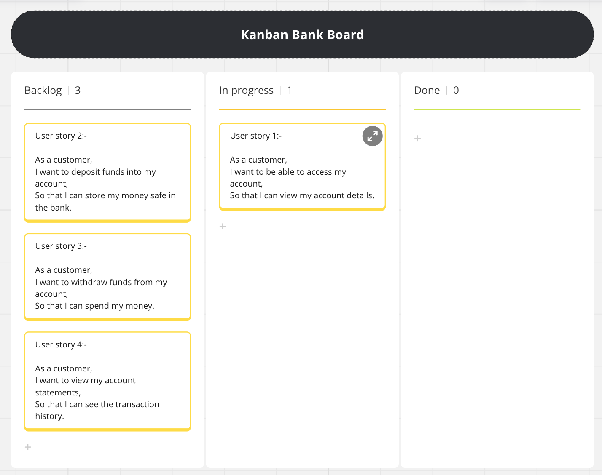
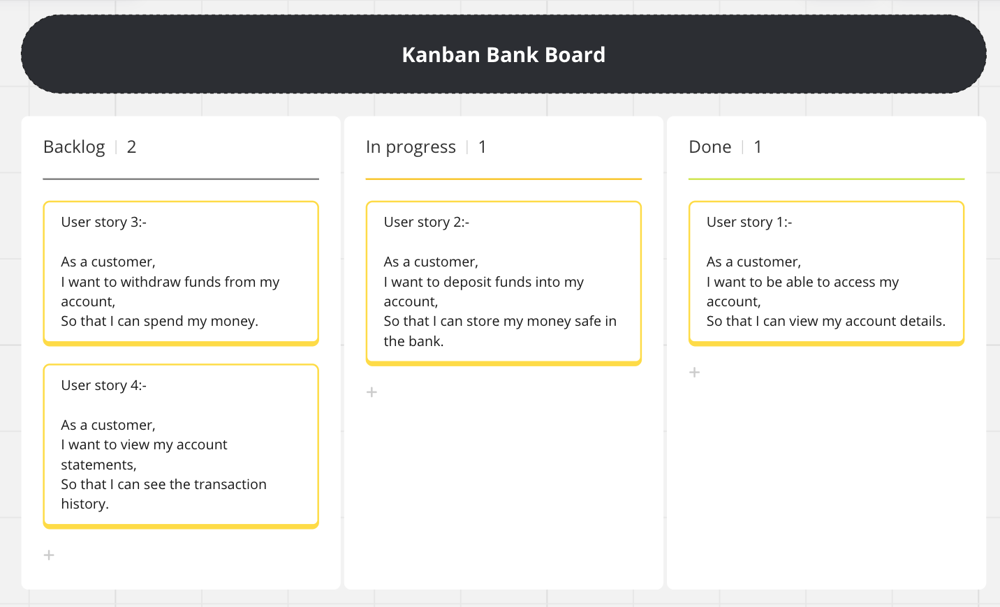
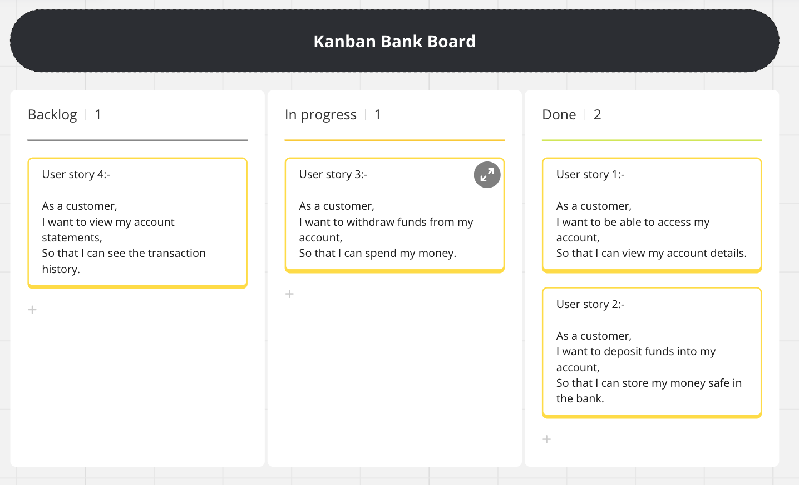
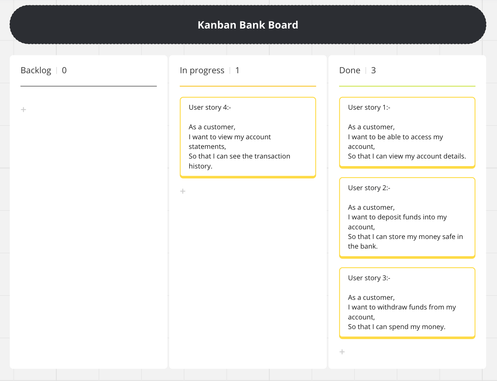
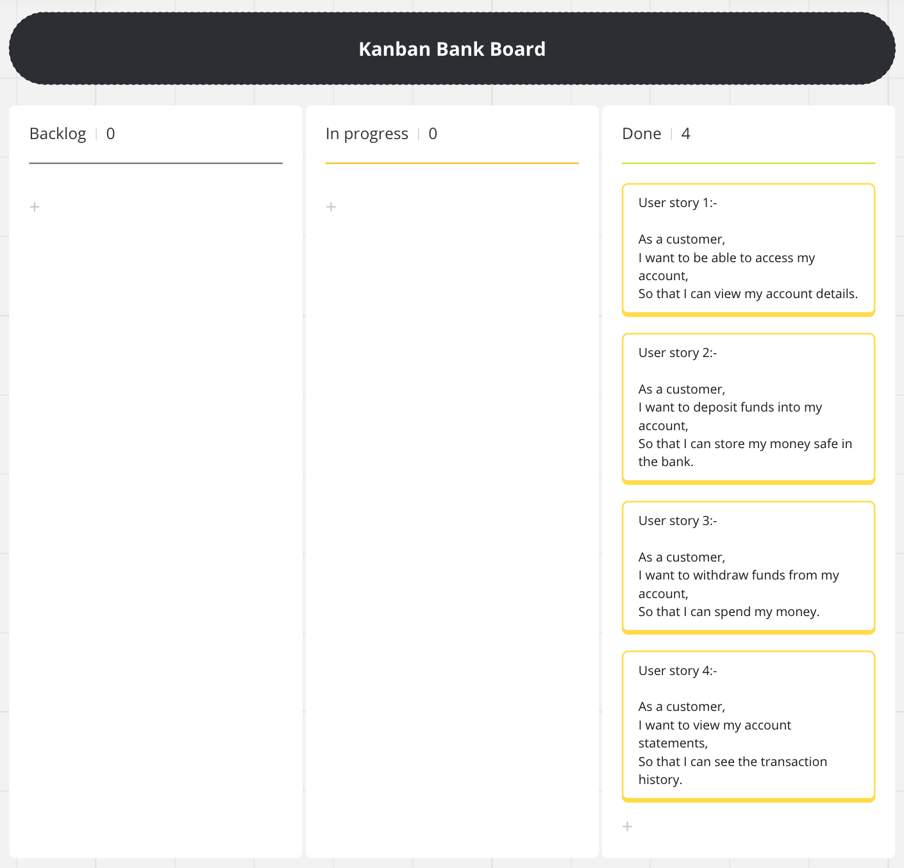

# Domain Models and Test Plan
## Task 1

### Introduction
Banking has existed for thousand of years, going back years even till ancient civilization. Ever since then the banking sector has grown and evolved, to the modern banking system we know today.
In earlier times, manual counting of money and the limited accessibility of banks was very time consuming. However, advancements in technology have alleviated these challenges. This also includes the creation of console banking application, which have improved the banking experience. In this discussion, we will explore the benefits of these applications for both end users and businesses.

### Benefits of the software to the end user 
- Easy to use
- Gives data in real time
- Flexibility
- Time saving
- Cost saving
  
### Benefits of the software to the business
- Customer Satisfaction
- Increase in profit
- Compete better with competitors
- Cost saving 
- Time saving

### Benefits of the software 
In general, the software aim is to improve the efficiency to gain user satisfaction and increase in profit for the business. The user satisfaction can be attained from the friendly interface making it easier to navigate and perform transactions. Users can do tasks like checking their account balance, depositing or withdrawing money, and seeing their transaction history without any hassle meaning they always know what's going on with their money. Furthermore, the flexibility of the application enables users to bank on their own terms, without being constrained by banking hours or bank locations. It also helps save money for both user and business by cutting down on fees for activities such as ATM withdrawals and the reduction in staff and bank properties will reduce cost hugely. This will attract loyal based customers. Overall, it's a win-win for both users and business.

---
## Task 2 and Task 3

### User Stories and Domain Models

#### User story 1:-
As a customer,  
I want to be able to access my account,  
So that I can view my account details.  

| Object |    Properties     |                Messages                 |  Output  |
| :----: | :---------------: | :-------------------------------------: | :------: |
|  User  | userName(@String) |              getUsername()              | @String  |
|        | password(@String) |              getPassword()              | @String  |
|        |                   | login(userName@String, password@String) | @boolean |
#### User story 2:-
As a customer,  
I want to deposit funds into my account,  
So that I can store my money safe in the bank.  

|   Object    |            Properties            |           Messages           | Output  |
| :---------: | :------------------------------: | :--------------------------: | :-----: |
|    User     |     userActions@bankAccount      |  depositMoney(@Transaction)  |  @void  |
| BankAccount | transactions@Array[@Transaction] | moneyDeposited(@Transaction) |  @void  |
|             |          balance@double          |         getBalance()         | @double |
| Transaction |          value(@double)          |          getValue()          | @double |
|             |          date(@String)           |          getDate()           | @String |
|             |          type(@String)           |          getType()           | @String |

#### User story 3:-
As a customer,  
I want to withdraw funds from my account,  
So that I can spend my money.  

|   Object    |            Properties            |           Messages           | Output  |
| :---------: | :------------------------------: | :--------------------------: | :-----: |
|    User     |     userActions@bankAccount      | withdrawMoney(@Transaction)  |  @void  |
| BankAccount | transactions@Array[@Transaction] | moneyWithdrawn(@Transaction) |  @void  |
|             |          balance@double          |         getBalance()         | @double |
| Transaction |          value(@double)          |          getValue()          | @double |
|             |          date(@String)           |          getDate()           | @String |
|             |          type(@String)           |          getType()           | @String |

#### User story 4:-
As a customer,  
I want to view my account statements,  
So that I can see the transaction history.  

|        Object        |            Properties            |                   Messages                   |        Output        |
| :------------------: | :------------------------------: | :------------------------------------------: | :------------------: |
|     BankAccount      |          balance@double          |                 getBalance()                 |       @double        |
|                      | transactions@Array[@Transaction] |              getTransactions()               | @Array[@Transaction] |
| BankStatementPrinter |                                  | printBankStatement(@Transaction,Balance@int) |       @String        |

### Kanban Board

link to kanban board:-
https://miro.com/app/board/uXjVKLSb69w=/ 